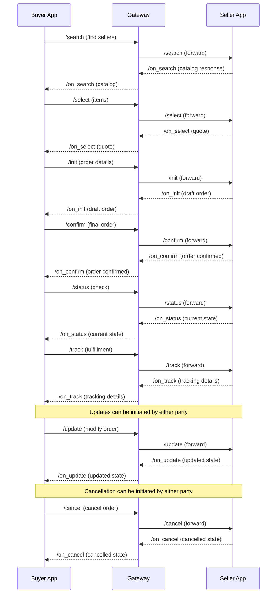

```mermaid
sequenceDiagram
    participant B as Buyer App
    participant G as Gateway
    participant S as Seller App
    
    %% Search Flow
    B->>G: /search (find sellers)
    G->>S: /search (forward)
    S-->>G: /on_search (catalog response)
    G-->>B: /on_search (catalog)
    
    %% Select Flow
    B->>G: /select (items)
    G->>S: /select (forward)
    S-->>G: /on_select (quote)
    G-->>B: /on_select (quote)
    
    %% Init Flow
    B->>G: /init (order details)
    G->>S: /init (forward)
    S-->>G: /on_init (draft order)
    G-->>B: /on_init (draft order)
    
    %% Confirm Flow
    B->>G: /confirm (final order)
    G->>S: /confirm (forward)
    S-->>G: /on_confirm (order confirmed)
    G-->>B: /on_confirm (order confirmed)
    
    %% Status & Tracking
    B->>G: /status (check)
    G->>S: /status (forward)
    S-->>G: /on_status (current state)
    G-->>B: /on_status (current state)
    
    B->>G: /track (fulfillment)
    G->>S: /track (forward)
    S-->>G: /on_track (tracking details)
    G-->>B: /on_track (tracking details)
    
    %% Update Flow
    Note over B,S: Updates can be initiated by either party
    B->>G: /update (modify order)
    G->>S: /update (forward)
    S-->>G: /on_update (updated state)
    G-->>B: /on_update (updated state)
    
    %% Cancel Flow
    Note over B,S: Cancellation can be initiated by either party
    B->>G: /cancel (cancel order)
    G->>S: /cancel (forward)
    S-->>G: /on_cancel (cancelled state)
    G-->>B: /on_cancel (cancelled state)
```
