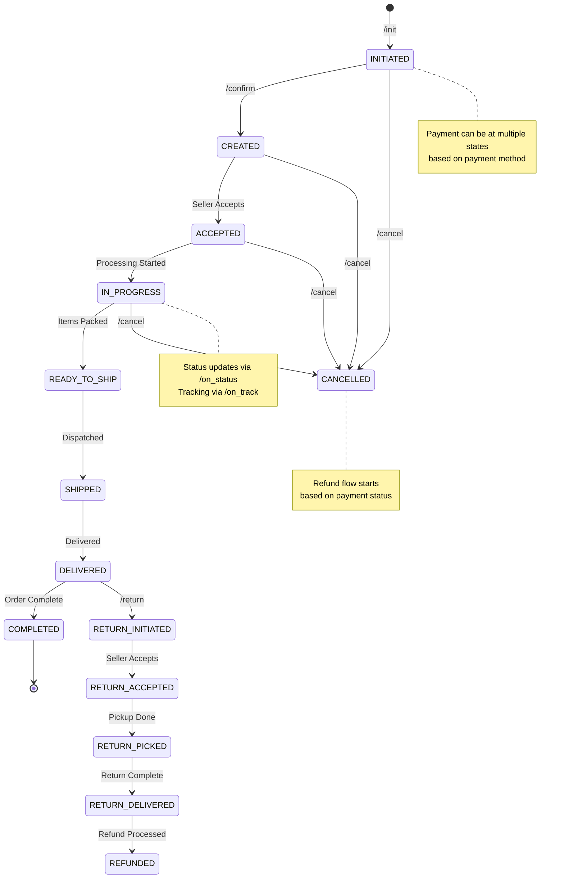

```mermaid
stateDiagram-v2
    [*] --> INITIATED: /init
    INITIATED --> CREATED: /confirm
    CREATED --> ACCEPTED: Seller Accepts
    ACCEPTED --> IN_PROGRESS: Processing Started
    
    IN_PROGRESS --> READY_TO_SHIP: Items Packed
    READY_TO_SHIP --> SHIPPED: Dispatched
    SHIPPED --> DELIVERED: Delivered
    DELIVERED --> COMPLETED: Order Complete
    COMPLETED --> [*]
    
    INITIATED --> CANCELLED: /cancel
    CREATED --> CANCELLED: /cancel
    ACCEPTED --> CANCELLED: /cancel
    IN_PROGRESS --> CANCELLED: /cancel
    
    DELIVERED --> RETURN_INITIATED: /return
    RETURN_INITIATED --> RETURN_ACCEPTED: Seller Accepts
    RETURN_ACCEPTED --> RETURN_PICKED: Pickup Done
    RETURN_PICKED --> RETURN_DELIVERED: Return Complete
    RETURN_DELIVERED --> REFUNDED: Refund Processed
    
    note right of INITIATED
        Payment can be at multiple states
        based on payment method
    end note
    
    note right of IN_PROGRESS
        Status updates via /on_status
        Tracking via /on_track
    end note
    
    note right of CANCELLED
        Refund flow starts
        based on payment status
    end note

```
